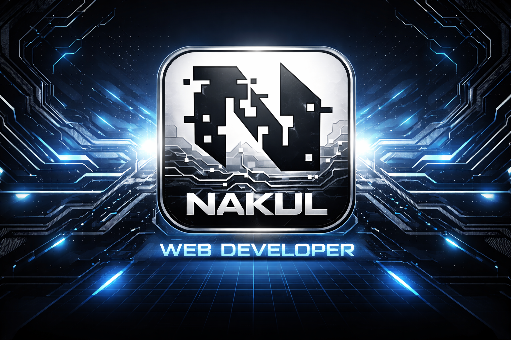

<h1 align="center">Hi 👋, I'm Nakul</h1>
<h3 align="center">Frontend Web Developer | UI & Interactive Web Enthusiast 🇮🇳</h3>

 

<!-- BANNER IMAGE -->

  

 

  

---

<table width="100%">
<tr>
<td width="65%" valign="top">

### 👤 Personal Information
-  **Role:** Student & Frontend Web Developer  
-  **Location:** India  
-  **Focus Area:** Frontend Development & UI Design  
-  **Interests:** Web animations, clean UI, real-world projects  
-  **Mindset:** Learning by building & improving every day  

</td>
<td width="35%" align="center">

</td>
</tr>
</table>

---

### 👨‍💻 About Me
-  Currently working on **learning modern web technologies**
-  Learning **Frontend Web Development (HTML, CSS, JavaScript)**
-  I enjoy converting **ideas into interactive websites**
-  Fun fact: I love **pixel-perfect layouts and smooth animations**

---

### 🌐 Portfolio
🔗 **All my projects:**  
👉 https://nakulsh02.github.io/Portfolio_

---

### 📫 Contact
📧 **Email:** nakulsharma02011@gmail.com  

---

### 🛠️ Languages & Tools

  

